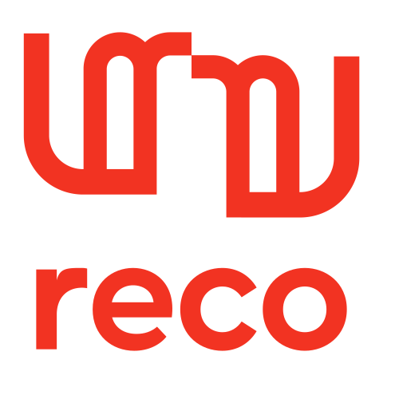
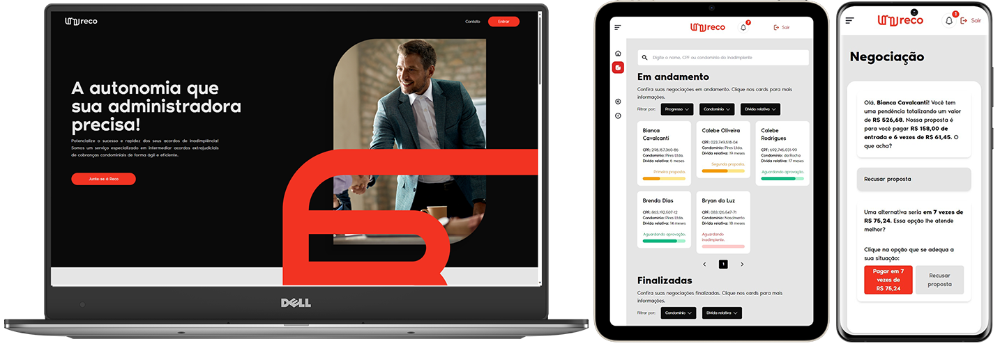

<p align="center">
  
</p>

> Uma plataforma web, que automatiza a negociação de casos de inadimplência condominial. 🏆 Ganhador de 3/4 premiações dentre os projetos de [Projetão 2023.2](https://projetao.com.br/).



## O que é o projeto?

Através do projeto, as administradoras podem cadastrar devedores (nome, condomínio e dívida total), e criar links únicos nos quais os devedores poderão negociar dentro dos limites, valor e parcelamento de reserva e a melhor proposta, estabelecidos pelas administradoras. O projeto foi desenvolvido por uma equipe de 10 pessoas, em constante contato com o cliente, seguindo a [metodologia de design](https://autumn-polyanthus-1b3.notion.site/Reco-4977a3135e7645d1b1f83c6c9a9be697?pvs=4) e boas práticas de [gerenciamento de projeto](https://github.com/users/fpeduu/projects/1). O projeto pode ser acessado em [reco-ai.vercel.app](https://reco-ai.vercel.app/), o pitch do projeto pode ser acessado no [Figma](https://www.figma.com/file/1uLPbMhSNexhygowLFBLXO/Apresenta%C3%A7%C3%A3o---Justi%C3%A7a-eficaz?node-id=1733%3A2054&mode=dev).

## Descrição técnica

O projeto foi desenvolvido utilizando o framework [Next.js](https://nextjs.org/) para o frontend, [MongoDB](https://www.mongodb.com/) como banco de dados, um servidor websocket [Python](https://www.python.org/) para o backend, para o funcionamento das **notificações** e **envio de e-mail**. O projeto foi hospedado utilizando a Vercel e [Heroku](https://www.heroku.com/) no caso do backend.

## Premiações

- [x] Melhor Pitch
- [x] Melhor Potencial de mercado
- [x] Melhor Projeto

## Como executar o projeto

Faça o clone do projeto ou faça o download do repositório, e siga os passos abaixo:

### Variáveis de ambiente

#### Frontend
- **MONGODB_URI**: URI de conexão com o MongoDB
- **NEXTAUTH_SECRET**: Secret do NextAuth, hash de 32 dígitos, para uso da biblioteca "next-auth"
- **NEXTAUTH_URL**: Apenas em dev, URL da página web (usualmente, http://localhost:3000)
- **NEXT_PUBLIC_BACKEND_URL**: URL do servidor (usualmente, http://localhost:8080)
- **NEXT_PUBLIC_VERCEL_URL**: URL da página web, a Next já adiciona essa variável em prod

#### Backend
- **EMAIL_ADDRESS**: O endereço de email que será usado para enviar emails
- **EMAIL_PASSWORD**: A senha do email que será usado para enviar emails

#### As adicionando ao projeto:

```bash
# Crie um arquivo .env.local e .env nos projetos
$ touch nextjs_frontend/.env.local
$ touch python_backend/.env
# Copie o conteúdo do arquivo .env.example para o .env
$ cp nextjs_frontend/.env.example nextjs_frontend/.env
$ cp python_backend/.env.example python_backend/.env
# Modifique as variáveis de ambiente
```

### Frontend

```bash
# Instala o yarn (gerenciador de pacotes)
$ npm install --global yarn
# Acesse a pasta do frontend
$ cd nextjs_frontend
# Instale as dependências
$ yarn install
# Rode o projeto
$ yarn dev
```

### Backend

```bash
# Acesse a pasta do backend
$ cd python_backend
# Instale as dependências
$ pip install -r requirements.txt
# Rode o projeto
$ uvicorn main:app --host 0.0.0.0 --port 8080 --reload
```

----
| [<br><sub>Karlos Hedylson <br>Project Manager</sub>](https://www.linkedin.com/in/karloshedylson/) | [<br><sub>Vitória Beltrão <br>Design Lead</sub>](https://www.linkedin.com/in/vitoriabeltrao/) | [<br><sub>José Danilo <br>Tech Lead</sub>](https://www.linkedin.com/in/jdaniloc/) | [<br><sub>Eduardo Amorim <br>AI Specialist</sub>](https://www.linkedin.com/in/eduardo-amorim-eaa/) | [<br><sub>Israel Vieira <br>Graphic Designer</sub>](https://www.linkedin.com/in/israel-vieira-2b70661a5/) |
| :---: | :---: | :---: | :---: | :---: |
[<br><sub>Vinicius Resende <br>Frontend Developer</sub>](https://www.linkedin.com/in/vin%C3%ADcius-resende-barbosa/) | [<br><sub>Karen Samara <br>Frontend Developer</sub>](https://www.linkedin.com/in/karen-samara/) | [<br><sub>Filipe Eduardo <br>Backend Developer</sub>](https://www.linkedin.com/in/fpeduu/) | [<br><sub>Luana Ferragut <br>UI/UX Designer</sub>](https://www.linkedin.com/in/luana-ferragut-a41692230/) | [<br><sub>Maria Clara <br>UI/UX Designer</sub>](https://www.linkedin.com/in/maria-clara-706a04239/)